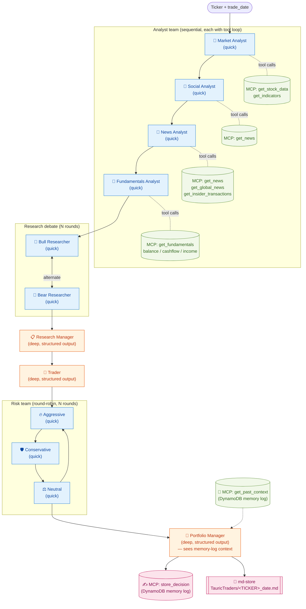
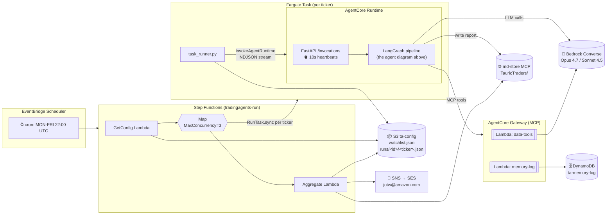

# TradingAgents on AWS — Architecture

This document describes how the LangGraph agent pipeline is composed and how
it sits inside the AWS deployment (AgentCore Runtime + Fargate + Step
Functions). Both diagrams render in any Markdown viewer that supports
Mermaid (GitHub, VS Code, Obsidian, MkDocs, etc.).

## 1. Agent interaction inside a single ticker run

The LangGraph `StateGraph` below is what runs per ticker inside one
AgentCore Runtime invocation. The quick-think LLM (Claude Sonnet 4.5) drives
the tool-calling analysts and debators; the deep-think LLM (Claude Opus 4.7)
is reserved for the three structured-output agents (Research Manager,
Trader, Portfolio Manager).



### What each node does

| Agent | Model class | Role |
|---|---|---|
| Market / Social / News / Fundamentals Analysts | quick | Call vendor-abstract data tools (yfinance / alpha_vantage), summarize findings |
| Bull / Bear Researchers | quick | Take analyst reports and argue opposing positions over `max_debate_rounds` |
| Research Manager | deep | Adjudicates the bull/bear debate and emits a structured investment plan |
| Trader | deep | Converts the plan into a structured trade proposal (ticker, size, timing) |
| Aggressive / Conservative / Neutral Analysts | quick | Round-robin stress test of the trade over `max_risk_discuss_rounds` |
| Portfolio Manager | deep | Final decision. Reads recent same-ticker decisions + cross-ticker lessons from the memory log before deciding |

## 2. AWS orchestration around the pipeline



## 3. Design points worth calling out

- **Two-LLM split** — quick-think (Sonnet 4.5) handles the tool-calling
  analysts and debators, which are many short calls. Deep-think (Opus 4.7)
  is reserved for the three structured-output agents where forced tool
  calling + reasoning quality matter.
- **Debate loops** — Bull ↔ Bear and Aggressive → Conservative → Neutral
  cycle until the configured round cap, then fall through to the next
  manager. Controlled by `max_debate_rounds` / `max_risk_discuss_rounds`.
- **Portfolio Manager memory injection** — before PM runs, `get_past_context`
  pulls recent same-ticker decisions plus cross-ticker lessons from
  DynamoDB; after PM runs, `store_decision` appends a pending entry. The
  next run for the same ticker fetches realized returns (raw + alpha vs
  SPY) via yfinance and writes a reflection back into the log.
- **Streaming isn't just cosmetic** — the FastAPI 10-second heartbeat loop
  is what keeps AgentCore Runtime's 15-minute idle timer from killing long
  deep-research runs. Every heartbeat resets the idle clock.
- **Fargate replaces Lambda as the per-ticker invoker** — deep runs
  (AMZN / AMD / WDC showed 16–20 min each) blow past Lambda's 15-minute
  hard cap. Fargate tasks have no such limit; both the AgentCore Runtime
  container and the Fargate task_runner reuse the same ECR image (CMD
  override selects the entry point).
- **Everything tagged `UsedBy=TauricTrading`** — applied app-wide via
  `cdk.Tags.of(app).add(...)`. Two AWS resource types (`GatewayTarget` and
  `Scheduler::Schedule`) don't support resource-level tags; their parents
  (Gateway and the scheduler role) carry the tag.

## 4. How AgentCore is used in this solution

AgentCore shows up in three places. They work together but each is a
distinct piece of the puzzle.

### 4.1 AgentCore Runtime — hosts the LangGraph agent

Serverless container host for the trading agent itself. Every invocation
gets an isolated session; we don't manage task definitions, lifecycle, or
scaling.

- **Resource**: `arn:aws:bedrock-agentcore:us-east-1:590183796434:runtime/tradingagents_runtime-FW3y90CfX9`
- **Container**: ARM64 image from `ECR/tradingagents-agentcore:latest`
- **Endpoints on :8080** (required by AgentCore):
  - `GET /ping` — health check
  - `POST /invocations` — runs one ticker end-to-end
- **Implementation**: [`tradingagents/agentcore/app.py`](../tradingagents/agentcore/app.py)

The `/invocations` handler does four things:

1. Spawns a worker thread running the LangGraph pipeline
   (`TradingAgentsGraph.propagate`).
2. Streams NDJSON events: a `heartbeat` line every 10 seconds while the
   pipeline is working, then a final `result` line with the decision,
   per-model token usage, cost, and the md-store report key.
3. Writes the per-ticker Markdown report to md-store
   (`TauricTraders/<TICKER>_<date>.md`) before returning the result event.
4. Persists the decision to the DynamoDB memory log via the Gateway.

The heartbeat loop is load-bearing, not cosmetic: AgentCore terminates any
invocation that goes 15 minutes without a response byte, and deep-research
runs (4 analysts + 2 debate rounds) routinely take 15–20 minutes.

### 4.2 AgentCore Gateway — exposes tools as a managed MCP server

Gateway gives us a single MCP endpoint that the agent talks to, backed by
multiple Lambda targets. Auth is unified (AWS_IAM / SigV4); tool schemas
are declared once on the `GatewayTarget` and auto-served to MCP clients.

- **URL**: `https://tradingagents-gw-eeb2skm5k7.gateway.bedrock-agentcore.us-east-1.amazonaws.com/mcp`
- **Authorizer**: `AWS_IAM` — the agent's execution role holds
  `bedrock-agentcore:InvokeGateway`; Gateway's own role has Lambda
  `InvokeFunction` for each target.
- **Targets**:

| Target | MCP tools exposed | Backing store |
|---|---|---|
| `data-tools` | `get_stock_data`, `get_indicators`, `get_fundamentals`, `get_balance_sheet`, `get_cashflow`, `get_income_statement`, `get_news`, `get_global_news`, `get_insider_transactions` | yfinance / alpha_vantage (via the existing `tradingagents.agents.utils.agent_utils` helpers) |
| `memory-log` | `get_past_context`, `store_decision`, `get_pending_entries` | DynamoDB `ta-memory-log` |

Target Lambda code:
[`infra/lambdas/data_tools/handler.py`](../infra/lambdas/data_tools/handler.py) ·
[`infra/lambdas/memory_log/handler.py`](../infra/lambdas/memory_log/handler.py).

### 4.3 The invocation path — how Fargate calls AgentCore

Step Functions fans out per-ticker work to Fargate; each Fargate task
calls AgentCore Runtime and stays on the NDJSON stream until the agent
finishes.

```text
Step Functions Map iteration
   ↓ RunTask.sync (Fargate)
Fargate task  —  tradingagents/agentcore/task_runner.py
   ↓ boto3.client("bedrock-agentcore").invoke_agent_runtime(
   ↓     agentRuntimeArn=…,
   ↓     payload={ticker, trade_date, …},
   ↓     accept="application/x-ndjson")
AgentCore Runtime  —  hosted FastAPI container
   ↓ runs the LangGraph pipeline in a worker thread
   ↓ emits heartbeat events every 10 s, then a final result event
Fargate task
   ↓ iter_lines over the StreamingBody
   ↓ discards heartbeats, keeps the result
   ↓ writes s3://ta-config/runs/<run_id>/<ticker>.json
```

Inside the AgentCore container, whenever the LangGraph agent needs market
data or memory access:

```text
LangGraph agent  (inside AgentCore Runtime)
   ↓ MCP tool call (HTTPS) to the Gateway URL
AgentCore Gateway  —  MCP server
   ↓ SigV4 auth check → routes to the matching target
Lambda (data-tools or memory-log)
   ↓ yfinance / DynamoDB
   ↓ returns result back through Gateway
```

### 4.4 Why AgentCore specifically (not just ECS + Lambda)

Three things Gateway + Runtime give us that would have been painful to
build otherwise:

1. **Session-isolated long-running containers** with no infra management.
   A plain ECS Service would require managing task definitions, lifecycle,
   and scaling per invocation. AgentCore scopes session state to a single
   `InvokeAgentRuntime` call and tears everything down afterward.
2. **Native MCP aggregation** via Gateway. Without it we'd either
   (a) stand up an MCP server from scratch fronting the Lambdas, or
   (b) hand the agent direct Lambda-invoke permissions and lose the
   tool-catalog pattern that makes the agent framework-agnostic.
3. **Standard invocation protocol** (`InvokeAgentRuntime`) that Step
   Functions, Lambda, and any other AWS service can hit without caring
   about the internal framework. If we swap LangGraph for Strands Agents
   or CrewAI later, nothing upstream changes.

### 4.5 Runtime environment variables

Set on the AgentCore Runtime resource (CDK `EnvironmentVariables` block;
can also be updated with `aws bedrock-agentcore-control update-agent-runtime
--environment-variables ...`):

| Name | Purpose |
|---|---|
| `MD_STORE_SECRET_ID` | `tradingagents/md-store-bearer` — Secrets Manager entry holding the md-store bearer token |
| `MD_STORE_AGENT_ID` | `tauric-traders` — value sent in the `X-Agent-Id` header on md-store calls |
| `TRADINGAGENTS_MEMORY_BACKEND` | `dynamodb` — swaps the decision log from file-based to the DDB backend |
| `TRADINGAGENTS_MEMORY_TABLE` | `ta-memory-log` — DDB table name used by the DDB backend |
| `AWS_DEFAULT_REGION` | `us-east-1` — boto3 region for the Bedrock / DDB / Secrets Manager clients inside the container |

Per-run data (ticker, date, run_id, model overrides) is passed in the
`POST /invocations` JSON body rather than the env, so the same running
Runtime handles every scheduled ticker.

## 5. Where this comes from in the repo

- Agent graph construction: [`tradingagents/graph/setup.py`](../tradingagents/graph/setup.py) — `GraphSetup.setup_graph`.
- FastAPI + streaming: [`tradingagents/agentcore/app.py`](../tradingagents/agentcore/app.py).
- Fargate entrypoint: [`tradingagents/agentcore/task_runner.py`](../tradingagents/agentcore/task_runner.py).
- CDK stack: [`infra/lib/tradingagents-stack.ts`](../infra/lib/tradingagents-stack.ts).
- Lambda handlers (get-config / aggregate / error / MCP-target data-tools / MCP-target memory-log): [`infra/lambdas/`](../infra/lambdas/).
